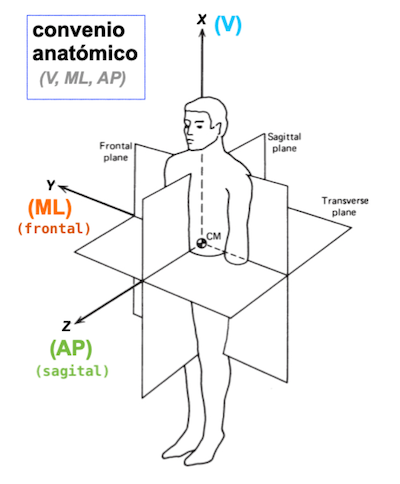

# 🧠 SiMuR Tools — MATLAB Toolbox para el Análisis de Movimiento

**Grupo:** SiMuR — Universidad de Oviedo  
**Versión:** 1.5 (Octubre 2025)  
 
---

## 📘 Descripción General

**SiMuR Tools TB** es un conjunto de funciones en MATLAB diseñadas para facilitar el procesamiento, análisis y visualización de datos provenientes de sensores en estudios de biomecánica y control del movimiento humano, especialmente sensores inerciales tipo IMUs (Xsens DOT, Shimmer, Bimu, etc.) 

El toolbox permite desde la **carga y preprocesamiento de señales**, hasta la **detección automática de eventos**, el **cálculo de parámetros espacio-temporales** y la **estimación de orientación** y **ángulos articulares** en tiempo real.

Las herramientas sirven tanto para trabajar con archivos de datos generados por sensores comerciales, como con datos estandarizados en el formato **IMUstd**, que se describe más adelante. 

---

## 🧩 Estructura del Toolbox

Las funciones están organizadas por **bloques funcionales**, lo que facilita su uso modular dentro de pipelines personalizados de análisis.

| Categoría | Funciones Principales | Descripción |
|------------|-----------------------|--------------|
| **Carga de Datos** |   `carga_IMUstd` | Lectura de archivos con formato *IMUstd*.|
| **Preprocesamiento** | `filtro_paso_bajo_f0`, `eliminar_duplicados`, `corrige_eventos_pie`, `corrige_seniales_pie` | Limpieza y filtrado de señales, corrección de eventos y duplicados. |
| **Cálculo Espacial / Cinemático** | `doble_integracion`, `doble_integracion_ddi`, `doble_integracion_lri`, `doble_integracion_msi`, `doble_integracion_ofi`, `doble_integracion_zijlstra`, `distancia_pendulo`, `distancia_arco`, `distancia_recorrida_extremos`, `trayectoria_marcador` | Integración de aceleraciones y cálculo de distancias y trayectorias. |
| **Eventos y Segmentación** | `eventos_pie_carrera`, `eventos_cog_carrera`, `eventos_cog_caminar`, `eventos_cog_salto`, `segmenta_intentos`, `tiempos_eventos_carrera`, `mostrar_eventos`, `mostrar_patrones` | Detección automática de eventos de pie, centro de gravedad o salto, y segmentación de intentos. |
| **Parámetros de Rendimiento** | `cadencia`, `amplitud_impacto_pie_carrera`, `amplitud_frenado_pie_carrera`, `aceleracion_vert_frenado_pie_carrera`, `aceleracion_vert_impacto_pie_carrera`, `aceleracion_mediolateral_pie_carrera` | Extracción de variables biomecánicas de interés para análisis de carrera o marcha. |
| **Orientación y Estimación Angular** | `orientacion_giroscopo`, `orientacion_compas`, `orientacion_kalman`, `estimacion_rotacion_triad` | Estimación de orientación de sólidos rígidos a partir de IMUs mediante distintos métodos (complementario, Kalman, TRIAD). |
| **Visualización 3D** | `mostrar_patrones`, `dibujar_sistema_referencia`, `mostrar_marcadores_solido_rigido`, `mostrar_orientacion_solido_rigido`, `dibujar_voxel`, `esfera_3d`, `crear_solido_prismatico` | Representación gráfica de sistemas de referencia, marcadores y volúmenes 3D. |
| **Utilidades y Matemática General** | `busca_maximos`, `busca_maximos_local`, `busca_maximos_umbral`, `anatomical_to_isb`, `separar_celda_por_fila`, `distancia_raiz_cuarta`, `integracion_acumulada_cav_simpson` | Funciones auxiliares para optimización, búsqueda de picos y transformaciones anatómicas. |
| **Gestión de Bases de Datos** |  `db_prueba`, `db_intentos`,  `carga_bimu`, `carga_shimmer`, `carga_dot`, `carga_silop`, `lectura_archivo_csv`, `resume_intentos` | Creación de archivos de formato IMUstd. |

---

## 🧱 Convenciones y Estructura de Carpetas

```
SimurTools/
│
├── carga_*                 % Funciones de lectura de datos
├── eventos_*               % Detección de eventos biomecánicos
├── db_*                       % Creación de Bases de Datos en el formato IMUstd 
├── orientacion_*           % Estimación de orientación
├── dibujar_*, mostrar_*    % Visualización 3D
├── doble_integracion_*     % Métodos de integración
├── amplitud_*, rms_*       % Parámetros de rendimiento
├── Contents.m              % Índice automático del toolbox
└── README.md               % Este archivo
```

---

## ⚙️ El formato IMU estándar (IMUstd)

 El formato **IMUstd** es un tipo de dato estandarizado, especialmente útil para trabajar con la **SIMUR Tools TB**. 
 Se define para homogeneizar la información proveniente de la gran diversidad de IMUs disponibles en el mercado.
  
 Un **IMUstd** es un sensor colocado de cierta manera, en una cierta localización del cuerpo, y con ciertas propiedades. 
 Se define con una estructura que consta de dos partes: datos y metadatos.
 
### Datos: 
las señales de los sensores ordenadas en columnas:

| Tipo de dato | Etiqueta Principales | Unidades |
|------------|-----------------------|----------------------|
| Acelerómetro | "Acc_X", "Acc_Y", "Acc_Z" |ms |
| Giroscopio | "Gyr_X", "Gyr_Y", "Gyr_Z"|ms |
| Magnético |"Mag_X", "Mag_Y", "Mag_Z"|ms |
|Ángulos de Euler | "Eul_X", "Eul_Y", "Eul_Z"|ms |
|Cuaternion|"Quat_W", "Quat_X", "Quat_Y", "Quat_Z"|ms |
|Número de muestra|"PacketCounter"| ms |
|Instante de la muestra|"Time"| ms |
|Estado de la batería|"Battery"| ms |
|Código de estado|"Status"| ms |
|Uso reservado|"Var24"| - |
|Uso reservado|"Index"| - |

### Metadatos: 
información referida al tipo de sensor y su colocación:

| Metadato |  Información | Ejemplo |
|------------|-----------------------|----------------------|
|IMU | ID del sensor utilizado  | 'DOT8' |
|ubicacion | Dónde se colocó el sensor | 'FL' 'FR' 'COG' |
|modelo | Etiqueta del modelo comercial | 'Xsens Dot' |
|frecuencia | muestreo del sensor | 30, 60, 100, 120... Hz |
|orientacion | relativa respecto al **sistema de referencia IMUstd**, de convenio {V, ML, AP} ("anatómico") | [3,-1,2] |
|intervaloIntento | muestra inicial y final de interés, del archivo raiz | [600, 14000] |

La función *carga_IMUstd* de la TB está pensada para leer un archivo de un **IMUstd** y devolver las señales de acelerómetros y giroscopios referidas a
un sistema de referencia *anatómico*, de convenio (V, ML, AP).



---

## 🚀 Instalación

Se puede instalar mediante el AddsOn Manager propio de Matlab

---

## 🧪 Ejemplo de Uso

```matlab
% Ejemplo básico de pipeline con datos de carrera

% 1. Filtrar aceleraciones
data.acc = filtro_paso_bajo_f0(data.acc, 20, data.freq);

% 2. Detectar eventos de pie
[ic, fc, maxS, minS, mvp, mp] = eventos_pie_carrera(data.gyr, 10, data.freq);

% 3. Calcular tiempos de fase
tiempos = tiempos_eventos_carrera(ic, fc, maxS, minS, mvp, mp, data.freq);

% 4. Calcular cadencia
cad = cadencia(ic, fc, data.freq);

% 5. Visualizar resultados
dibujar_sistema_referencia();
```

---

## 🧩 Dependencias

* MATLAB R2020a o superior
* Toolboxes recomendados:

  * **Signal Processing Toolbox**
  * **Optimization Toolbox**
  * **Aerospace Toolbox** *(para algunos cálculos de orientación)*
 
**En caso de tener la Robotic Toolbox se recomienta desinstalarla o evitar sus funciones para cálculos de cuaterniones, ya que utiliza diferentes esquema**

---

## 📚 Cita y Atribución

Si utilizas este toolbox en una publicación científica, cita de la siguiente manera:

>  *SiMuR Tools: MATLAB Toolbox para el análisis biomecánico*, SiMuR, Universidad de Oviedo, 2025.

---

## 🧠 Créditos

Desarrollado en el **SiMuR Lab** (Simulación y Movimiento Humano) — Universidad de Oviedo.
Contacto: [[juan@uniovi.es](mailto:juan@uniovi.es)]

---


