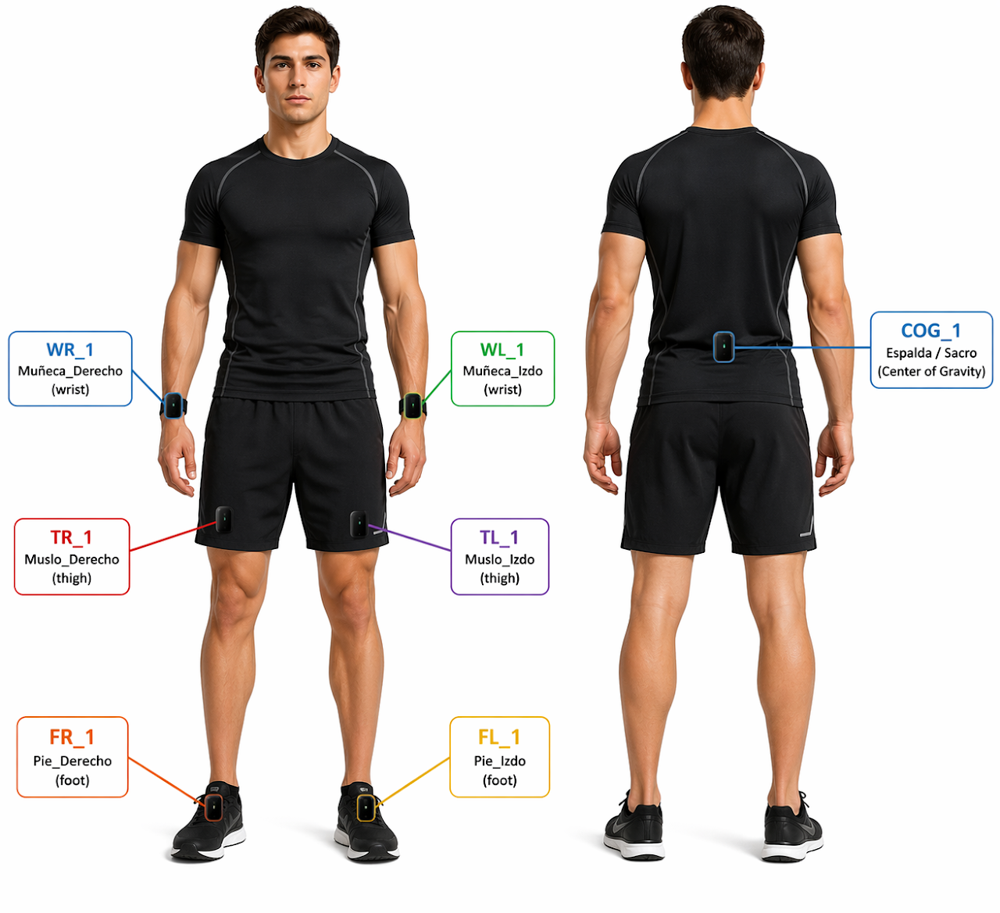

# 🧠 SiMuR Tools — MATLAB Toolbox para el Análisis de Movimiento
[](https://doi.org/10.5281/zenodo.19816490)

**Grupo:** SiMuR — Universidad de Oviedo  
**Versión:** 1.6 (Abril 2026)  
 
---

## Contenidos

1. [📘 Descripción General](#1-descripción-general)
2. [🧩 Uso de la Toolbox](#2-uso-de-la-toolbox)
3. [🧪 Ejemplos de Uso](#3-ejemplos-de-uso)
4. [🧩 Estructura de la Toolbox](#4-estructura-de-la-toolbox)
5. [🚀 Instalación y Dependencias](#5-instalación-y-dependencias)
6. [⚙️ Archivos en formato IMUstd](#6-archivos-en-formato-imustd)

---

## 1. 📘 Descripción General

**SiMuR Tools TB** es un conjunto de funciones en MATLAB para el procesamiento, análisis y visualización de datos provenientes de sensores en estudios de biomecánica y control del movimiento humano, especialmente sensores inerciales tipo IMUs. 
Las herramientas abarcan la **detección automática de eventos**, el **cálculo de parámetros espacio-temporales** y la **estimación de orientación** y **ángulos articulares** en tiempo real.


La toolbox facilita la **carga y preprocesamiento de señales** provinientes de diferentes IMUs comerciales: Movella-DOT, Shimmer, Bimu, etc. También permite almacenarlos en un tipo de *archivos de datos estandarizado* (formato **IMUstd**), que facilita su explotación y uso posteriores.


---

## 2. 🧩 Uso de la Toolbox

Las funciones están orientadas a varios **tipos de actividad física**: Caminar, Saltos, Carrera y Vallas. 


### 📊 Resumen de las funciones

```
Por tipo de Actividad (19 funciones)
├── 🚶 Caminar ............... 8 funciones
├── 🏃 Carrera ............... 9 funciones
├── 🚧 Vallas ................ 1 funciones
├── 🦘 Saltos ................ 1 funciones

```
```
Auxiliares para cálculo y visualización (30+ funciones)
├── 🦴 Segmentos 3D .......... 5 funciones
├── 🔄 Utilidades numéricas .. 8 funciones
├── ⌚ En desarrollo ......... 2 funciones
└── ⚙️ Infraestructura ....... 20+ funciones
```

---

### 📡 ¿Qué señales necesito?

Para preparar tus datos antes de llamar a cualquier función de la TB, es recomendable entender el **convenio de ejes**. Las funciones suponen que las señales están referidas a un sistema de referencia que denominamos **sistema anatómico**, definido así:

| Eje IMUstd | Etiqueta | Dirección positiva |
|:----------:|----------|--------------------|
| **V**  | `Acc_X` / `Gyr_X` | Vertical, hacia arriba |
| **ML** | `Acc_Y` / `Gyr_Y` | MedioLateral, hacia la derecha |
| **AP** | `Acc_Z` / `Gyr_Z` | AnteroPosterior, hacia adelante |


En la siguiente tabla se resumen algunos ejemplos de las **señales mínimas requeridas** en algunas funciones. Se indican qué ejes del acelerómetro (`Acc_*`) y del giroscopio (`Gyr_*`) son necesarios, y en qué sensor deben estar registrados.


| Actividad | Sensor* | Señales requeridas | Señales opcionales | Funciones principales |
|-----------|--------|--------------------|--------------------|----------------------|
| 🚶 **Caminar** (COG) | `COG_1` | `Acc_Z` (AP), `Acc_X` (V) | `Gyr_Y` (ML) para orientación | `eventos_cog_caminar`, `eventos_cog_tiempo_real_caminar`, `distancia_pendulo_cog_caminar` |
| 🚶 **Caminar** (muñeca) | `WR_1` / `WL_1` | `Acc_X` (V), `Acc_Y` (ML), `Acc_Z` (AP) | — | `pasos_muneca_caminar`, `pasos_muneca_fusion_caminar` |
| 🏃 **Carrera** (pie) | `FR_1` / `FL_1` | `Gyr_Y` (ML) | `Gyr_Z` (AP) para pronación | `eventos_pie_carrera`, `tiempos_eventos_carrera` |
| 🏃 **Carrera** (COG) | `COG_1` | `Acc_X` (V), `Acc_Z` (AP) | — | `eventos_cog_carrera`, `distancia_vert_cog_carrera` |
| 🚧 **Vallas** | `COG_1` | `Acc_X` (V), `Acc_Y` (ML), `Acc_Z` (AP) | — | `eventos_cog_vallas` |
| 🦘 **Salto** | `COG_1` | `Acc_X` (V) | — | `eventos_cog_salto`, `evalua_cog_salto` |

> El campo **Sensor** se refiere a las posibles colocaciones del sensor en el cuerpo se detallan más adelante.
> 
> **Nota sobre unidades:** Las aceleraciones se expresan en **m/s²** (con eje V centrado en ~9,81 m/s² en reposo). Las velocidades angulares en **°/s**. Las funciones de estimación de distancia esperan aceleraciones en m/s².


---


## 3. 🧪 Ejemplos de Uso

La carpeta [`Examples/`](Examples/) contiene cuatro demos ejecutables directamente en MATLAB. Cada una incluye sus propios archivos de datos de ejemplo en `Examples/data/` y **no requiere ninguna configuración previa**.

---

### 🚶 Localización 2D al caminar — `demo_caminar_posicion2D`

Reconstruye la trayectoria (x, y) de una persona con un sensor en L3, combinando detección de paso en tiempo real, modelo de péndulo para la distancia por paso y giróscopo para la orientación.

```matlab
>> demo_caminar_posicion2D
```

**Archivo de datos:** `data/ejemplo_caminar_posicion2D.log` — señales Xsens en formato texto, 100 Hz

---

### 🏃 Análisis de carrera con IMU en el pie — `demo_carrera_pie`

Pipeline completo de carrera: detección de eventos del ciclo de zancada, tiempos de fase, cadencia y amplitudes de impacto y frenado. Produce una tabla resumen de resultados.

```matlab
>> demo_carrera_pie
```

**Archivo de datos:** `data/ejemplo_carrera.mat` — formato IMUstd con sensores `FR_1` (pie derecho) y `FL_1` (pie izquierdo)

---

### 🚧 Análisis de carrera de vallas — `demo_vallas_COG`

Detección automática de eventos de valla desde el COG y visualización de patrones de señal paso a paso.

```matlab
>> demo_vallas_COG
```

**Archivo de datos:** `data/ejemplo_vallas.mat` — formato IMUstd con sensor `COG_1`

---

### 🦘 Análisis de saltos verticales — `demo_salto_cog`

Estima duración, altura y energía de tres saltos verticales y compara los resultados obtenidos con tres sistemas: cámara de movimiento, plataforma de fuerzas e IMU en el COG.

```matlab
>> demo_salto_cog
```

**Archivos de datos:**
- `data/ejemplo_salto_camara.trc` — posición vertical del marcador [mm], 100 Hz
- `data/ejemplo_salto_plataforma.xls` — fuerza de reacción por pie [N], 100 Hz
- `data/ejemplo_salto_imu.log` — aceleraciones Xsens en COG, 100 Hz

---


## 4. 🧩 Estructura de la Toolbox

Las funciones principales están organizadas por **tipo de actividad física**: Caminar, Saltos, Carrera y Vallas. Se les asigna un nombre con una estructura `que_como_actividad`:

- `que` — qué se mide: Eventos, Tiempo, Distancia, Aceleracion...
- `como` — condición(es) como la colocación del IMU, el método de cálculo, etc.
- `actividad` — Caminar, Saltos, Carrera, Vallas, etc.


```
Por tipo de Actividad (19 funciones)
├── 🚶 Caminar ............... 8 funciones
├── 🏃 Carrera ............... 9 funciones
├── 🚧 Vallas ................ 1 funciones
├── 🦘 Saltos ................ 1 funciones

```


## 🚶 Caminar (Walking/Gait)
Funciones para análisis de la marcha normal. 
   
| Función | Descripción |
|---------|-------------|
| `eventos_cog_caminar` | Detecta IC, TO y eventos intermedios (método Auvinet) |
| `eventos_cog_tiempo_real_caminar` | Detección online muestra a muestra |
| `distancia_pendulo_cog_caminar` | Estimación de distancia con modelo de péndulo invertido |
| `distancia_pendulo_parcial_cog_caminar` | Péndulo con corrección en fase de doble apoyo |
| `distancia_arco_cog_caminar` | Modelo de arco angular para estimación de paso |
| `distancia_raiz_cuarta_cog_caminar` | Modelo empírico de Weinberg |
| `pasos_muneca_caminar` | Conteo de pasos desde acelerómetro de muñeca |
| `pasos_muneca_fusion_caminar` | Conteo con fusión de múltiples sensores |

**Demo:** [`Examples/demo_caminar_posicion2D.m`](Examples/demo_caminar_posicion2D.m) — reconstrucción de la posición 2D a partir de IMU en L3.

## 🏃 Carrera (Running)
Funciones específicas para análisis de carrera con IMU en pie o centro de gravedad.

| Función | Descripción |
|---------|-------------|
| `eventos_pie_carrera` | Detecta IC, FC, máximos/mínimos del ciclo de zancada |
| `eventos_cog_carrera` | Eventos biomecánicos desde el centro de gravedad |
| `tiempos_eventos_carrera` | Calcula tiempos de fase (contacto, vuelo, swing) |
| `amplitud_impacto_pie_carrera` | Pico de aceleración vertical en heel-strike |
| `amplitud_frenado_pie_carrera` | Deceleración tras contacto inicial |
| `aceleracion_vert_impacto_pie_carrera` | RMS de aceleración en fase de impacto |
| `aceleracion_vert_frenado_pie_carrera` | RMS de aceleración en fase de frenado |
| `aceleracion_mediolateral_pie_carrera` | Análisis de estabilidad lateral |
| `distancia_vert_cog_carrera` | Oscilación vertical del centro de gravedad |

**Demo:** [`Examples/demo_carrera_pie.m`](Examples/demo_carrera_pie.m) — ejemplo completo de pipeline con IMU en el pie.


## 🚧 Vallas (Hurdles)
Para análisis de carreras de vallas.

| Función | Descripción |
|---------|-------------|
| `eventos_cog_vallas` | Detección de eventos en carrera con vallas |

**Demo:** [`Examples/demo_vallas_COG.m`](Examples/demo_vallas_COG.m) — ejemplo completo de pipeline con IMU en el COG.


## 🦘 Saltos (Jumping)
Para análisis de salto vertical y pliometría.

| Función | Descripción |
|---------|-------------|
| `eventos_cog_salto` | Detecta inicio, contacto inicial, impacto y preparación para el contacto |
| `evalua_cog_salto` | Calcula duración, altura y energía de cada salto a partir de los eventos |

**Demo:** [`Examples/demo_salto_cog.m`](Examples/demo_salto_cog.m) — estimación de altura y duración de saltos verticales comparando cámara, plataforma de fuerzas e IMU.


## ⚙️ Funciones Auxiliares

Además existen una serie de **funciones auxiliares** para cálculos, visualizaciones y otras utilidades. 


```
Auxiliares para cálculo y visualización (30+ funciones)
├── 🦴 Segmentos 3D .......... 5 funciones
├── 🔄 Utilidades numéricas .. 8 funciones
├── ⌚ En desarrollo ......... 2 funciones
└── ⚙️ Infraestructura ....... 20+ funciones
```


### 🦴 Análisis de Segmentos Corporales (3D Body Segments)
Para sistemas MOCAP, orientación de extremidades y biomecánica articular.

| Función | Descripción |
|---------|-------------|
| `azimut_giroscopo` | Integración de velocidad angular |
| `azimut_compas` | Estimación de heading desde magnetómetro |
| `azimut_kalman` | Fusión sensor mediante filtro de Kalman |
| `orientacion_triad` | Algoritmo TRIAD (acelerómetro + magnetómetro) |
| `extraer_info_mocap` | Parser de archivos de captura de movimiento |


### 🔄 Utilidades numéricas
Funciones de diferentes cálculos numéricos de utilidad general.

| Función | Descripción |
|---------|-------------|
| `doble_integracion` | Integración básica de aceleración a posición |
| `doble_integracion_ddi` | Método DDI (Drift Detection Integration) |
| `doble_integracion_lri` | Método LRI (Sabatini, 2005) |
| `doble_integracion_msi` | Método MSI (Mean Subtraction Integration) |
| `doble_integracion_ofi` | Método OFI (Optimal Frequency Integration) |
| `doble_integracion_zijlstra` | Método de Zijlstra/Kose |
| `rango_extremos` | Desplazamiento entre máximos y mínimos |
| `rango_marcador` | Distancia acumulada de un marcador |


### ⌚ Funcionalidades en desarrollo
Utilidades no consolidades, pero utilizables temporalmente.

| Función | Descripción |
|---------|-------------|
| `stepcount` | Algoritmo general de conteo de pasos |
| `cadencia` | Cálculo de pasos/min desde eventos IC/FC |


### ⚙️ Infraestructura Común (Core/Utils)
Carga de datos, preprocesamiento y visualización universal.

| Categoría | Funciones | Descripción |
|------------|-----------------------|--------------|
| **Carga de Datos** |   `carga_IMUstd` | Lectura de archivos con formato *IMUstd*.|
| **Preprocesamiento** | `filtro_paso_bajo_f0`, `eliminar_duplicados`, `corrige_eventos_pie`, `corrige_seniales_pie` | Limpieza y filtrado de señales, corrección de eventos y duplicados. |
| **Cálculo Espacial / Cinemático** | `doble_integracion`, `doble_integracion_ddi`, `doble_integracion_lri`, `doble_integracion_msi`, `doble_integracion_ofi`, `doble_integracion_zijlstra`, `distancia_pendulo_cog_caminar`, `distancia_arco_cog_caminar`, `rango_extremos`, `trayectoria_marcador` | Integración de aceleraciones y cálculo de distancias y trayectorias. |
| **Eventos y Segmentación** | `eventos_pie_carrera`, `eventos_cog_carrera`, `eventos_cog_caminar`, `eventos_cog_salto`, `tiempos_eventos_carrera`, `mostrar_eventos`, `mostrar_patrones` | Detección automática de eventos de pie, centro de gravedad o salto, y segmentación de intentos. |
| **Parámetros de Rendimiento** | `cadencia`, `amplitud_impacto_pie_carrera`, `amplitud_frenado_pie_carrera`, `aceleracion_vert_frenado_pie_carrera`, `aceleracion_vert_impacto_pie_carrera`, `aceleracion_mediolateral_pie_carrera` | Extracción de variables biomecánicas de interés para análisis de carrera o marcha. |
| **Orientación y Estimación Angular** | `azimut_giroscopo`, `azimut_compas`, `azimut_kalman`, `orientacion_triad`, `calibra_anatomical` | Estimación de orientación de sólidos rígidos a partir de IMUs mediante distintos métodos (complementario, Kalman, TRIAD). Incluye calibración de ejes anatómicos a partir de una zona estática. |
| **Visualización 3D** | `mostrar_patrones`, `dibujar_sistema_referencia`, `mostrar_marcadores_solido_rigido`, `mostrar_orientacion_solido_rigido`, `dibujar_voxel`, `esfera_3d`, `crear_solido_prismatico` | Representación gráfica de sistemas de referencia, marcadores y volúmenes 3D. |
| **Utilidades y Matemática General** | `busca_maximos`, `busca_maximos_local`, `busca_maximos_umbral`, `anatomical_to_isb`, `separar_celda_por_fila`, `distancia_raiz_cuarta_cog_caminar`, `int_acumulada_cam_simp` | Funciones auxiliares para optimización, búsqueda de picos y transformaciones anatómicas. |
| **Gestión de Bases de Datos** |  `db_prueba`, `db_intentos`,  `carga_bimu`, `carga_shimmer`, `carga_dot`, `carga_silop`, `lectura_archivo_csv`, `resume_intentos`, `extraer_info_mocab` | Creación de archivos de formato IMUstd. |

---


## 5. 🚀 Instalación y Dependencias

La última versión está disponible en Github. Existe una versión que se puede instalar mediante el AddsOn Manager propio de Matlab (en revisión).

Las dependencias son:

* MATLAB R2020a o superior
* Toolboxes recomendados:

  * **Signal Processing Toolbox**
  * **Optimization Toolbox**
  * **Aerospace Toolbox** *(para algunos cálculos de orientación)*
 
**En caso de tener la Robotics Toolbox se recomienta desinstalarla o evitar sus funciones para cálculos de cuaterniones, ya que utiliza diferentes esquema**

---


## 6. ⚙️ Archivos en formato IMUstd (*.mat)

Los archivos con formato **IMUstd** proporcionan datos estandarizados que facilitan trabajar directamente con la TB. Su finalidad es doble: la primera es homogeneizar la información proveniente de la gran diversidad de IMUs disponibles en el mercado (Xsens DOT, Shimmer, Bimu, etc.); la segunda es dar soporte a una **base de datos** en la que se guarden, además de las señales, información sobre las condiciones en las que se hizo esa captura.

Por tanto, un archivo en formato **IMUstd** contiene tanto las señales como las condiciones en las que se adquirieron, de _uno o varios IMUs_ simultáneamente. Se codifican en formato **.mat** de Matlab, y constan de una _tabla_ con las señales crudas o **datos** recogidos por el IMU y una _struct_ con los **metadatos** relacionados.

**Los datos** — las señales del sensor, ordenadas en columnas y etiquetadas así:

| Tipo de dato | Etiquetas | Unidades |
|---|---|---|
| Acelerómetro | `Acc_X`, `Acc_Y`, `Acc_Z` | m/s² |
| Giroscopio | `Gyr_X`, `Gyr_Y`, `Gyr_Z` | °/s |
| Magnético | `Mag_X`, `Mag_Y`, `Mag_Z` | µT |
| Ángulos de Euler | `Eul_X`, `Eul_Y`, `Eul_Z` | ° |
| Cuaternion | `Quat_W`, `Quat_X`, `Quat_Y`, `Quat_Z` | — |
| Nº de muestra | `PacketCounter` | — |
| Instante de la muestra | `Time` | s |
| Estado de la batería | `Battery` | — |
| Código de estado | `Status` | — |

**Los metadatos** — información del sensor y su colocación:

| Metadato | Descripción | Ejemplo |
|---|---|---|
| `IMU` | ID del sensor utilizado | `'DOT8'` |
| `ubicacion` | Dónde se colocó el sensor | `'FR_1'`, `'COG_1'` |
| `modelo` | Etiqueta del modelo comercial | `'Xsens Dot'` |
| `frecuencia` | Frecuencia de muestreo | `100`, `120` Hz |
| `orientacion` | Colocación respecto al convenio anatómico {V, ML, AP} | `[3, -1, 2]` |
| `intervaloIntento` | Muestra inicial y final del intento | `[600, 14000]` |

La función `carga_IMUstd` lee un archivo tipo IMUstd y aplica automáticamente la reorientación configurada en los metadatos, devolviendo siempre las columnas en el orden `[V, ML, AP]`.

---


### 📍 La ubicación de los sensores

Los IMUs que generaron la señal se habrán colocado en alguna parte del cuerpo.
Algunas utilidades necesitan conocer esto para funcionar correctamente. Se reserva un identificador con un código de **ubicación + número** (`ubicacion_N`) para los más frecuentes (el **número** es si van varios en el mismo sitio):

| Código | Ubicación | Colocación recomendada |
|--------|-----------|------------------------|
| `COG_1` | Centro de Gravedad | Sacro / espalda baja |
| `FR_1`  | Pie Derecho (*Foot Right*)   | Dorso del pie derecho |
| `FL_1`  | Pie Izquierdo (*Foot Left*)  | Dorso del pie izquierdo |
| `TR_1`  | Muslo Derecho (*Thigh Right*)  | Cara lateral del muslo derecho |
| `TL_1`  | Muslo Izquierdo (*Thigh Left*) | Cara lateral del muslo izquierdo |
| `WR_1`  | Muñeca Derecha (*Wrist Right*) | Cara dorsal de la muñeca derecha |
| `WL_1`  | Muñeca Izquierda (*Wrist Left*)| Cara dorsal de la muñeca izquierda |



---


## 📚 Cita y Atribución

[](https://doi.org/10.5281/zenodo.19816490)

Si utilizas este toolbox en una publicación científica, usa el botón **"Cite this repository"** de la barra lateral de GitHub, o consulta directamente el archivo [`CITATION.cff`](CITATION.cff).

---

## 🤝 Contribuir

¿Quieres añadir funciones o mejorar el toolbox? Consulta las instrucciones del equipo:

👉 [**Cómo contribuir → CONTRIBUTING.md**](CONTRIBUTING.md)

---

## 🧠 Créditos

Desarrollado en el **SiMuR Lab** (Simulación y Movimiento Humano) — Universidad de Oviedo.
Contacto: [[juan@uniovi.es](mailto:juan@uniovi.es)]

---


